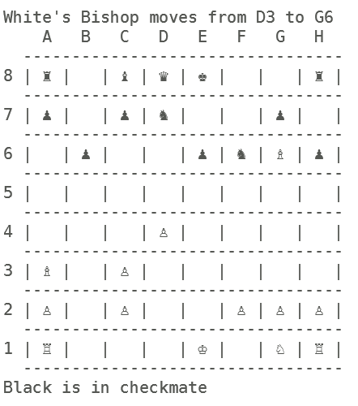

# 
 **Overview** 

Welcome to my chess engine project. This project was developed as part of my MSc in Computer Science.
The purpose of the engine is to simulate a chess game when provided with a series of moves.
`ChessMain.cpp` shows an example game - the format of each move is given in long form notation (e.g. "A7H6" describes moving a piece from A7 to H6)

## 
 **Simple Usage** 

To run the chess program
1. Clone this repository
2. Enter this directory and `make` the relative files
3. run `./bin/chess`

The program should run the chess game provided by `ChessMain.cpp` in the terminal. An example output is shown below:

## 
 **Example Output** 

  

## 
 **Making your own Chess Game** 

I have added a python script that will allow you to create the scripts for your own chess game that you find on chess.com
To run your own game do the following:

1. Go to chess.com and find a game that you wish to run
2. Download the respective pgn file for the game
3. Place the .pgn file in the `./Documents/InputPGNs/` folder, ensure that all white spaces are removed from the name
4. Run the `./generate_games/ChessScriptWriter.py` with any version of python (no imported librarys required). A text file will be created in `./Documents/OutputMoveScripts/` corresponding to your input. 
5. Copy the contents fo the text file into ChessMain.cpp so it replaces the currrent chessboard script

# 
 **File Description**
